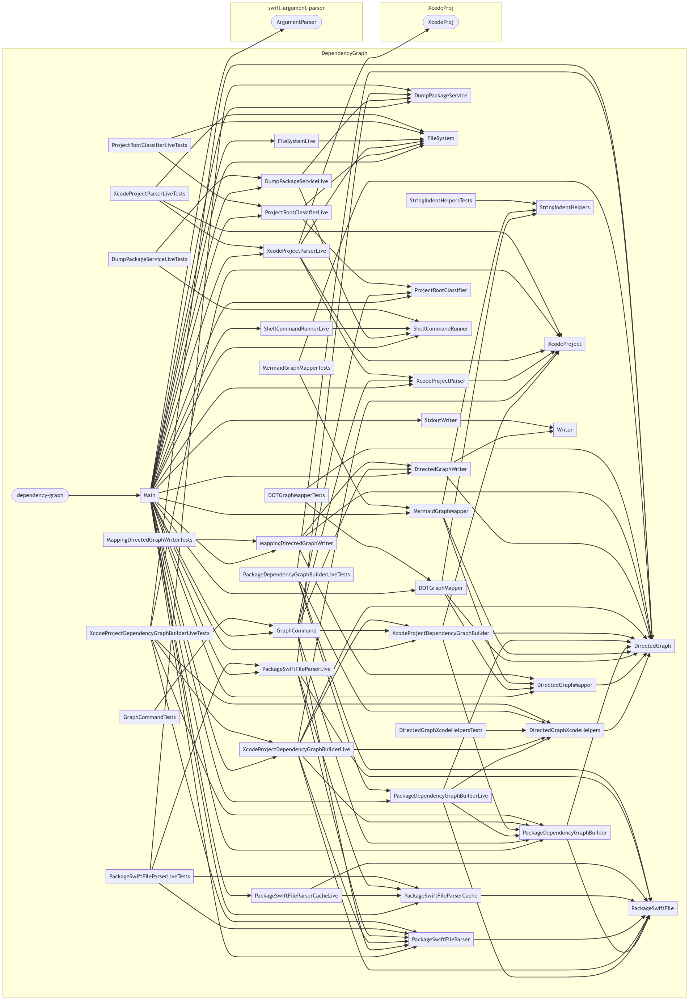
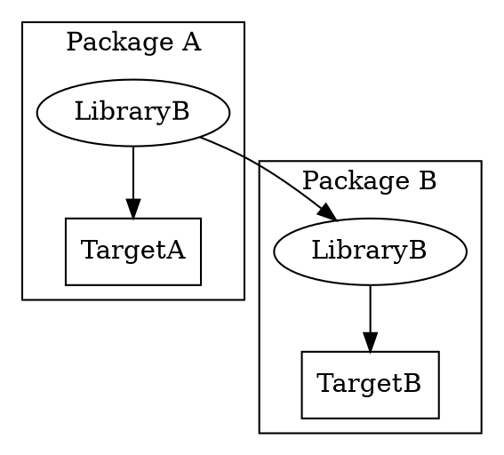
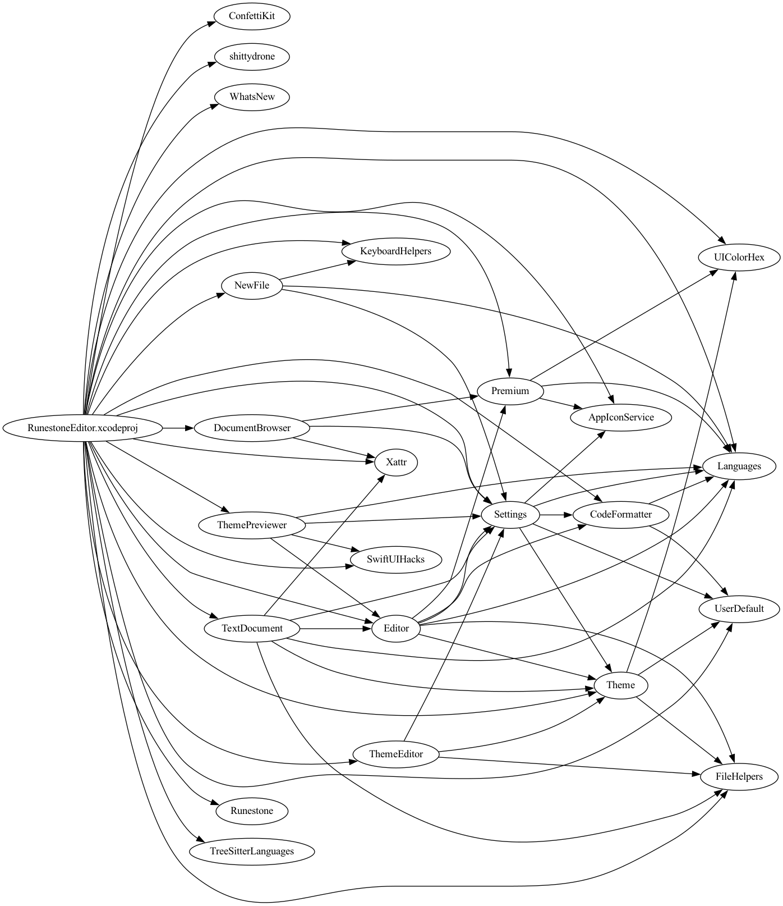
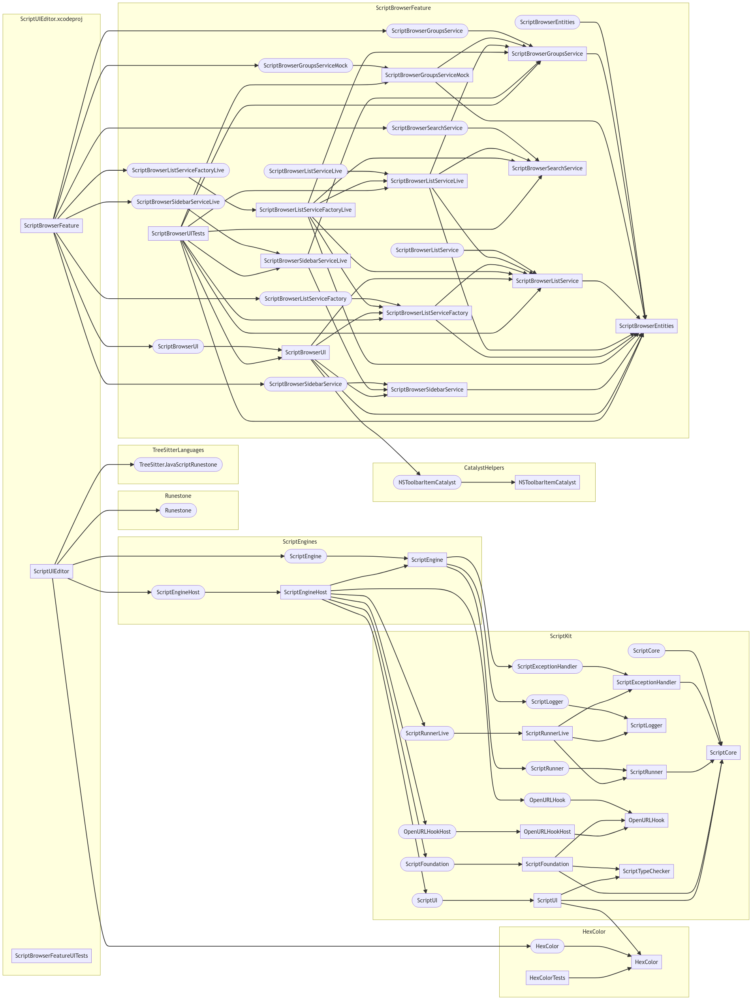

# 🕸️ dependency-graph

[](https://github.com/simonbs/dependency-graph/actions/workflows/build_and_test.yml) [](https://github.com/simonbs/dependency-graph/actions/workflows/swiftlint.yml)

dependency-graph is a command-line tool that can visualize the dependencies of packages. The tool takes the path to an Xcode project or a Package.swift file as input and outputs a graph that shows the dependencies of the packages in the project or package.

## 👀 Sample

The graph below shows the relationship of the products and targets in this package as of December 11, 2022. Click on the image to see a larger version.



Nodes shaped as an ellipse represent products, e.g. the libraries in a Swift package, and the square nodes represent targets.

## 🚀 Getting Started

Start off by installing the tool with [Homebrew](https://brew.sh).

```bash
brew tap simonbs/dependency-graph https://github.com/simonbs/dependency-graph.git
brew install dependency-graph
```

> **Note**
> if you got any error like this when running the above command on M1/M2 

```bash
Error: Cannot install under Rosetta 2 in ARM default prefix (/opt/homebrew)!
To rerun under ARM use:
    arch -arm64 brew install ...
To install under x86_64, install Homebrew into /usr/local.
```

> You can use the following solution:
```bash
arch -arm64 brew install dependency-graph
```

You may now run the following command to verify that the tool was installed correctly. The following command should print information on how the tool can be used.

```
dependency-graph --help
```

Run the `dependency-graph` command with the path to a folder containing an .xcodeproj or Package.swift file.

```bash
dependency-graph ~/Developer/Example
```

You may also pass the full path to the .xcodeproj or Package.swift file as shown below.

```bash
dependency-graph ~/Developer/Example/Example.xcodeproj
```

### Rendering a Graph

The `dependency-graph` command will output a textual representation of a graph. By default the tool will output a graph using the [DOT syntax](https://graphviz.org/doc/info/lang.html). For example, if the Xcode project or Package.swift file contains the following dependencies:

```
Library A in Package A depends on Target A
Library B in Package B depends on Target B
Library A in Package A depends on Library B in Package B
```

The output of the tool would be a graph that looks like this:



The output can be rendered to an image by piping it to the [dot CLI](https://graphviz.org/doc/info/command.html), which is part of [Graphviz](https://graphviz.org).

Install Graphviz and run `dependency-graph` and pass the output to the newly installed `dot` CLI.

```bash
brew install graphviz
dependency-graph ~/Developer/Example | dot -Tsvg -o graph.svg
```

The previous example output would look different but similar when using [the Mermaid diagram syntax](https://mermaid-js.github.io/mermaid/#/flowchart) instead. The syntax is used by passing the `--syntax mermaid` option.

Output in the Mermaid diagram syntax can be rendered to an image using the [the mermaid cli](https://github.com/mermaid-js/mermaid-cli).

```bash
npm install -g @mermaid-js/mermaid-cli
dependency-graph --syntax mermaid ~/Developer/Example | mmdc -o graph.svg
```

When rendering the graph to a PNG, you will likely want to specify the size of the output to ensure it is readable. You can do this with both the dot and mermaid CLIs.

To generate an image with dot that is exactly 6000 pixels wide or 8000 pixels tall but not necessarily both, do the following:

```bash
dependency-graph ~/Developer/norlys-ios/Features/Notes | dot -Tpng -Gsize=60,80\! -Gdpi=100 -o ~/Desktop/dot.png
```

To generate an image on a page that is 6000 pixels wide with mermaid, do the following:

```bash
dependency-graph --syntax mermaid ~/Developer/Example | mmdc -o graph.png -w 6000
```

You may also want to play around with the values for `--node-spacing` and `--rank-spacing` to increase the readability of the graph.

```bash
dependency-graph --syntax mermaid --node-spacing 50 --rank-spacing 150 ~/Developer/Example | mmdc -o graph.png
```

Pass the `--packages-only` flag to include only the Xcode project and Swift packages in the graph. This omits the libraries and targets within the Xcode project and Swift packages.



## 🤷‍♂️ OK, why?

As I'm splitting my iOS and macOS applications into small Swift packages with several small targets, I started wishing for a way to visualise the relationship between the products and targets in my Swift packages. That's why I built this tool.

Several other tools can visualise a Swift package, however, I wanted a tool that can take both a Swift package and an Xcode project as input.

The example in the top of this README shows a visualization of a Swift package and the graph below shows a visualisation of an Xcode project.
Notice that the left-most subgraph represents an Xcode project named ScriptUIEditor.xcodeproj and it has three targets: ScriptUIEditor, ScriptBrowserFeature, and ScriptBrowserFeatureUITests. Two of these depends on the Swift packages represented by the remaining subgraphs.

These graphs provide a good way to get an overview of a package or the relationship between several packages. Sometimes it can be helpful to generate multiple graphs to get a good overview, for example, a graph of the entire project and graphs of selected packages. Fortunately, the `dependency-graph` cLI makes this easy as it can take either an Xcode project and a Package.swift file as input.



## 🧐 ...but how?

dependency-graph parses Xcode project using [XcodeProj](https://github.com/tuist/XcodeProj) and interprets Package.swift files using the output from the `swift package dump-package` command. 

This means that dependency-graph does not perform any package resolution or build the project, making it very fast to run the `dependency-graph` command but also produces a less detailed output that tools that rely on package resolution.

The tool has a focus on visualising local dependencies, that is, Swift packages stored locally in a project. dependency-graph will include remote dependencies in the visualisation but it will not clone those dependencies to deterine their dependency graph. It is technically possible to include this but it has not been necessary for my use cases.
